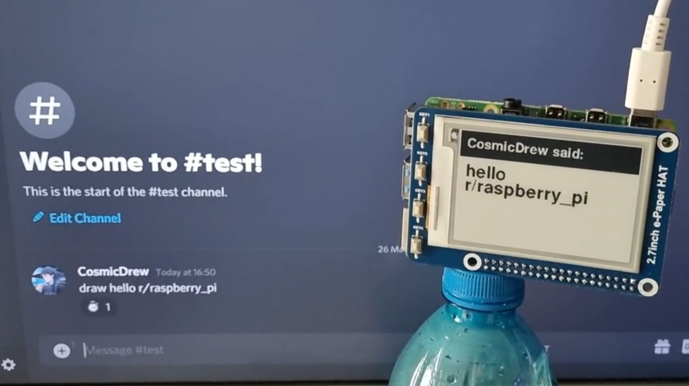

# RPI Discord Display


## Requirements
* Waveshare 2.7 Inch E-Paper Display HAT Module Kit 264 x 176 Resolution
* Raspberry Pi (tested on 3B and 4)

## Install the packages
```sh
npm i
pip3 install fastapi Pillow
```

## Running the project
### Discord Bot Client
Create a [Discord Application](https://discord.com/developers/applications) and place the token and the discord bot's ID as arguments
```sh
node bot.js <token> <bot ID>
```

### Python Backend
```sh
cd display
./start.sh
```

## Using the project
### Text
Head to a discord chat and type `draw <text>` to show the text on the screen

### Image
Type in `image` on a chat and attach a single image in the same message to have it displayed on the screen
